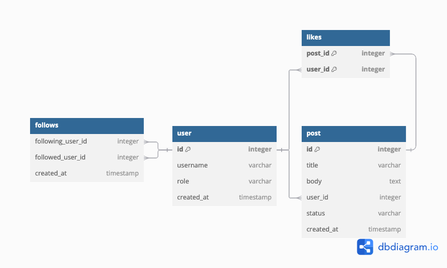
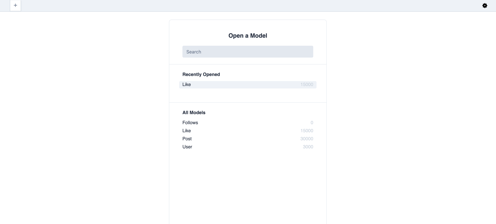
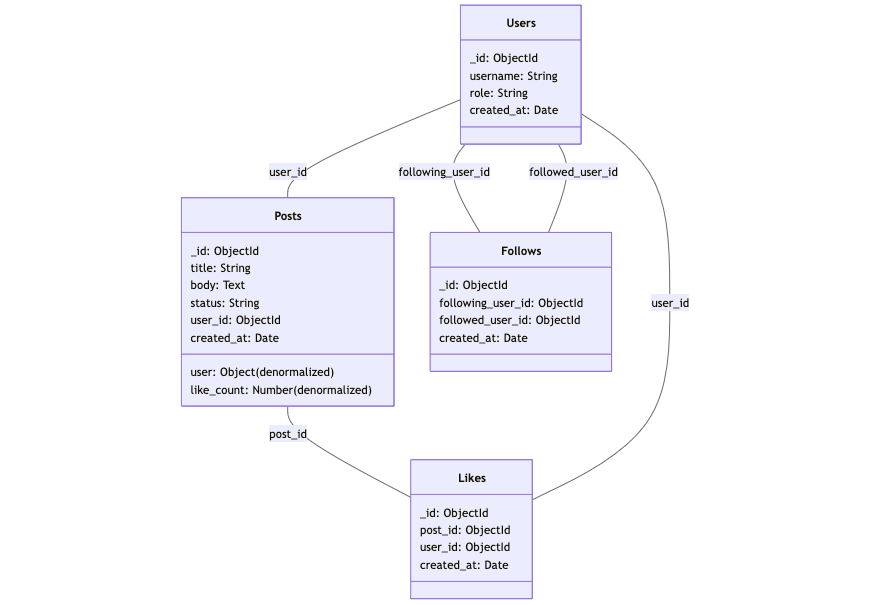
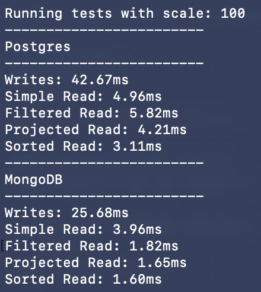
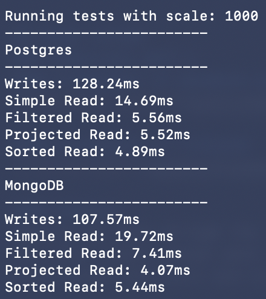
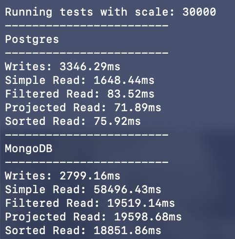
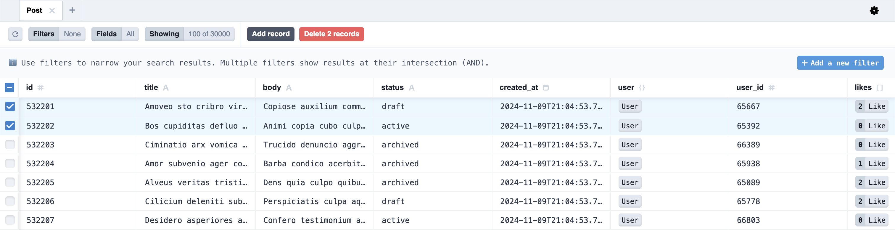

# DBI Comparison Rel DB vs Mongo

To install dependencies:
## Installation
```bash
bun install
```

## Dependencies
```bash
docker run -d -e POSTGRES_DB=mydb -e POSTGRES_PASSWORD=testpass123 -e POSTGRES_USER=postgres -p "6500:5432" postgres:17.0
docker run --name mongodb -p 27017:27017 -d mongodb/mongodb-community-server:latest
```


## Execution:
### Test
```bash
bun run src/test-runner.ts
```
### View persisted results
Test results can be found in the top level test-results.json;

To see the frontend execute:
```bash
bunx prisma studio
```

## Tasks solved
### Compulsary part 1
#### Screenshot of database model


#### Screenshot of frontend


#### Seeding
Seeding was done through the use of the faker-js framework. The three levels chosen were 100, 1000, 30000 posts which are interlinked with users and likes

### Compulsary part 2
#### Screenshot of Mongo DB model


#### Lauffähigkeit
Siehe die Lauffähigkeit des test-runner.ts scripts

### Compulsary part 3
#### Run with 100


#### Run with 1000


#### Run with 30000



### Additional work
#### Creation of frontend that allows for the use of filters 1.5 points 
